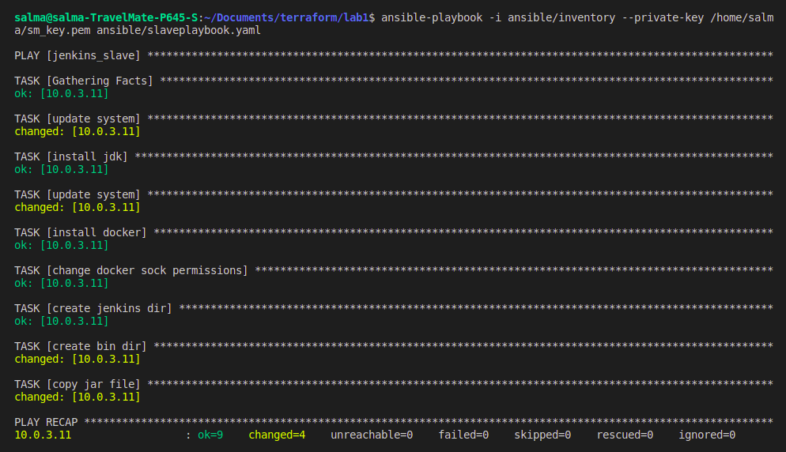

# Jenkins-Ansible-AWS

Create ansible script to configure application ec2(private)

- configure ansible to run over private ips through bastion (~/.ssh/config)

- write ansible script to configure ec2 to run  as jenkins slaves

- configure slave in jenkins dashboard (with private ip)

- create pipeline to deploy nodejs_example fro branch (rds_redis)

- add application load balancer to your terraform code to expose your nodejs app on port 80 on the load balancer

- test your application by calling loadbalancer_url/db and /redis

## Provision infrastructure on aws

```bash
terraform init
terraform plan --var-file prod.tfvars
terraform apply --var-file prod.tfvars
```


## Building jenkins image

```bash
docker build . -t dockerjenkins -f Dockerfile
docker run -d -p 8083:8080 -v /var/run/docker.sock:/var/run/docker.sock dockerjenkins
```


## SSH ****on private instance from jenkins container****

using ****jump host****

```bash
root@b9be4a5168b2:~# mkdir .ssh
root@b9be4a5168b2:~# cd .ssh
root@b9be4a5168b2:~/.ssh# vi config
#####
Host bastion-instance
    User ubuntu
    HostName 3.82.8.93  
    IdentityFile /root/.ssh/test-keypair.pem

host app-instance
   HostName  10.0.3.11 
   user ubuntu
   ProxyCommand ssh bastion-instance -W %h:%p
   identityFile /root/.ssh/terraform_key_pair.pem  

####
root@b9be4a5168b2:~/.ssh# vi test-keypair.pem
<<secret_key>>
root@b9be4a5168b2:~/.ssh# chmod 400 test-keypair.pem
root@b9be4a5168b2:~/.ssh# ssh app-instance
```


## ****private instance as a jenkins slave****

download agent.jar file from here


then put its path in the source 


## Run Ansible playbook

             to access private instance through bastion server

```bash
ansible-playbook -i inventory --private-key /home/salma/sm_key.pem
```



create the node


launching the node


## ****Build pipeline that pull docker file from git then build the image of the application then push it to dockerhub then deploy the application****


check the application


